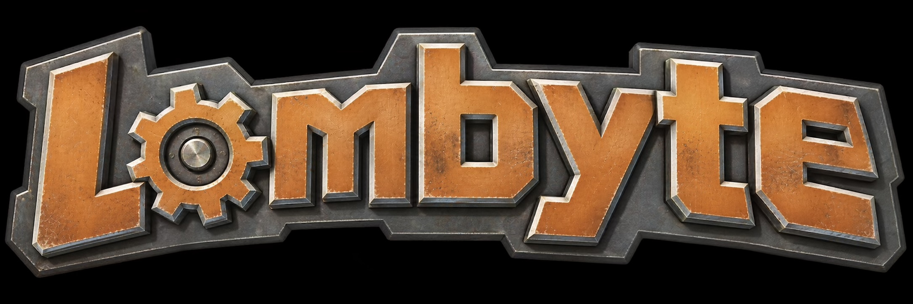

<p align="center">
  
</p>

<p align="center">
  <picture>
    <source media="(prefers-color-scheme: dark)" srcset="assets/lombyte-title-dark.svg">
    
  </picture>
</p>

<p align="center">
  <a href="https://mateuszklysz.github.io/Lombyte/"></a>
  <a href="https://decomp.dev/mateuszklysz/Lombyte"></a>
  <a href="docs/building.md"></a>
  <a href="CONTRIBUTING.md"></a>
</p>
<p align="center">
    A work-in-progress, byte-matching decompilation of Ratchet &amp; Clank (2002) for PlayStation 2.<br>
    Reconstructing the original game code in readable C, with a native Rust port as the long-term goal.
</p>

> [!NOTE]
> Yes, this project is AI-assisted— that’s pretty obvious. <br>
> AI helps me get more done, but I make the decisions and guide the project. <br>
> I put a lot of time and care into getting things right. Every PR and issue is manually reviewed.

> [!WARNING]
> Lombyte does not include game data, executables, disc images, or proprietary toolchains.<br>
> A legitimately obtained copy of the **USA / NTSC-U** release (`SCUS_971.99`) is required.

<h3>Decompilation progress</h3>

<p align="center">
  <a href="https://decomp.dev/mateuszklysz/Lombyte">
    
  </a>
</p>

<h3>Supported version</h3>

| Game                   | Platform      | Region       | Boot executable |
| ---------------------- | ------------- | ------------ | --------------- |
| Ratchet & Clank (2002) | PlayStation 2 | USA / NTSC-U | `SCUS_971.99`   |

Expected SHA-256 of the boot executable:

```text
e050581032e4bb3f20341307da5b69b76f1574910519155380ea771e55c3c0c9
```

Only this release is currently targeted. PAL, NTSC-J, and the PlayStation 3 remaster are not supported.

<h3>Contributing</h3>

Contributions to matching C, recovered names, types, and documentation are welcome. See [CONTRIBUTING.md](CONTRIBUTING.md) for the workflow and verification requirements.

<h4>Quick setup</h4>

```sh
git clone https://github.com/mateuszklysz/Lombyte.git && cd Lombyte
./setup.sh --iso /path/to/your-ratchet-and-clank-usa.iso
```

Windows, macOS and other options: [docs/building.md](docs/building.md#quick-setup).

Work-in-progress C is also welcome when it preserves the matching baseline. Do not submit game images, extracted game data, or proprietary compiler binaries.

<h3>Credits</h3>

- [objdiff](https://github.com/encounter/objdiff) — object-level comparison.
- [splat](https://github.com/ethteck/splat) and [spimdisasm](https://github.com/Decompollaborate/spimdisasm) — executable splitting and disassembly.
- [Himuro](https://github.com/Mikompilation/Himuro) — PS2 decompilation research and reference EE-GCC toolchain work used by Lombyte's matching compiler profiles.
- [bordplate/RC1](https://github.com/bordplate/RC1) & [Lynder063/rac1-decomp](https://github.com/Lynder063/rac1-decomp) — used as a reference for symbols, structs, and function logic (credited inline in the source).
- The PS2 reverse-engineering and decompilation communities for the tools and research that make matching projects possible.

<h3>License</h3>

Repository code is distributed under the [MIT License](LICENSE). Code reconstructed from third-party binaries remains the intellectual property of the respective copyright holders; see [THIRD_PARTY_NOTICES.md](THIRD_PARTY_NOTICES.md).

The Lombyte emblem in [`assets/`](assets/) is the project's original artwork.
